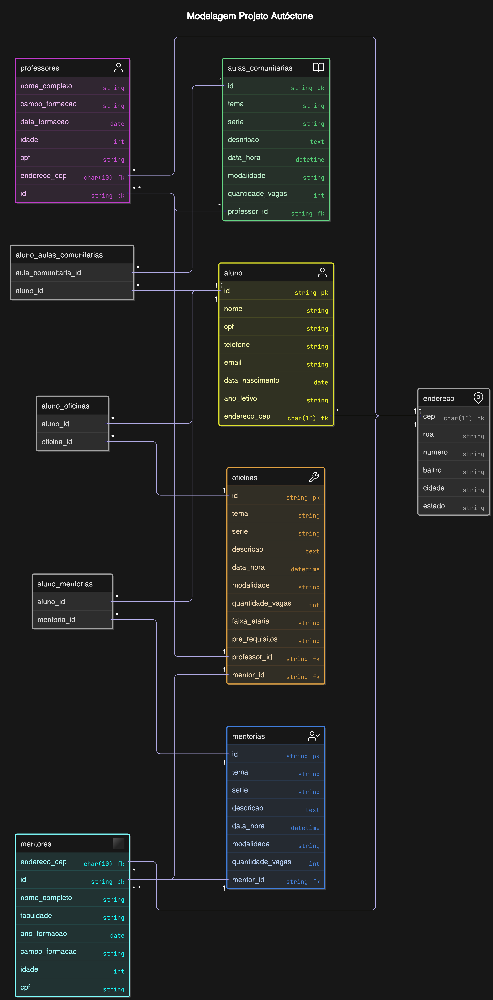

# Projeto Social da Recode - Projeto Autóctone

## Índice

1. [Sobre](#sobre)
   - [Nome do Projeto: "Projeto _Autóctone_"](#nome-do-projeto-projeto-autóctone)
     - [Etimologia da Palavra "Autóctone"](#etimologia-da-palavra-autóctone)
2. [Design do Projeto](#design-do-projeto)
3. [Modelagem do Banco de Dados](#modelagem-do-banco-de-dados)
   - [Modelagem Conceitual/Física](#modelagem-conceitualfísica)
   - [Modelagem Física do Banco de Dados](#modelagem-física-do-banco-de-dados)
4. [Licença](#licença)

## Sobre

Projeto social do squad45/51 da Recode Pro AI, cujo o tema é: **_Índigenas_**.

O projeto consiste em desenvolver uma plataforma digital que ajuda a preservar e disseminar o conhecimento indígena, além de facilitar a comunicação e a educação.

### Nome do Projeto: "Projeto _Autóctone_"

#### Etimologia da Palavra "Autóctone"

A palavra "_Autóctone_" tem origem no grego "autochthōn", que é uma combinação de "autos" (próprio) e "chthōn" (terra). O termo é utilizado para descrever algo ou alguém que é nativo ou originário do lugar onde se encontra. No contexto do nosso projeto, "Autóctone" reflete a valorização e preservação das culturas indígenas, que são as culturas originárias do nosso território.

## Design do Projeto

Estamos utilizando o template Creative da Start Bootstrap, o que acelerará o desenvolvimento e deixará o site visualmente atraente. No entanto, será necessário adaptar o tema, pois ele é originalmente uma landing page e precisamos transformá-lo em um site com 4 páginas.

Acesse o template: [Creative - Start Bootstrap](https://startbootstrap.com/theme/creative)

## Modelagem do Banco de Dados

A modelagem do banco de dados foi projetada para atender às necessidades do projeto, garantindo a integridade e a eficiência no armazenamento e recuperação dos dados. A estrutura do banco de dados inclui tabelas para armazenar informações sobre alunos, professores, mentores, aulas comunitárias, mentorias e oficinas. Além disso, foram criadas tabelas associativas para gerenciar os relacionamentos entre alunos e as atividades oferecidas. A modelagem foi feita de forma a permitir a fácil expansão e manutenção do sistema, utilizando chaves primárias e estrangeiras para assegurar a integridade referencial dos dados.

### Modelagem Conceitual/Física

Abaixo está a representação gráfica da modelagem do banco de dados:



### Modelagem Física do Banco de Dados

A modelagem física do banco de dados foi realizada utilizando o sistema de gerenciamento de banco de dados MySQL. Abaixo estão os scripts SQL que foram usados para criar as tabelas e definir os relacionamentos entre elas.

```sql
-- Criação do Banco de Dados
CREATE DATABASE ProjetoAutoctone;

USE ProjetoAutoctone;

-- Criação da tabela 'endereco'
CREATE TABLE endereco (
    cep CHAR(10) PRIMARY KEY,
    rua VARCHAR(255),
    numero VARCHAR(10),
    bairro VARCHAR(100),
    cidade VARCHAR(100),
    estado VARCHAR(50)
);

-- Criação da tabela 'aluno'
CREATE TABLE aluno (
    id INT AUTO_INCREMENT PRIMARY KEY,
    nome_completo VARCHAR(255) NOT NULL,
    cpf CHAR(11) UNIQUE NOT NULL,
    telefone VARCHAR(15),
    email VARCHAR(255) UNIQUE,
    data_nascimento DATE,
    ano_letivo YEAR,
    endereco_cep CHAR(10),
    FOREIGN KEY (endereco_cep) REFERENCES endereco(cep) ON DELETE CASCADE ON UPDATE CASCADE
);

CREATE INDEX idx_aluno_nome ON aluno(nome_completo);

-- Criação da tabela 'professores'
CREATE TABLE professores (
    id INT AUTO_INCREMENT PRIMARY KEY,
    nome_completo VARCHAR(255) NOT NULL,
    campo_formacao VARCHAR(255),
    data_formacao DATE,
    data_nascimento DATE,
    cpf CHAR(11) UNIQUE NOT NULL,
    endereco_cep CHAR(10),
    FOREIGN KEY (endereco_cep) REFERENCES endereco(cep) ON DELETE CASCADE ON UPDATE CASCADE
);

CREATE INDEX idx_professor_nome ON professores(nome_completo);

-- Criação da tabela 'mentores'
CREATE TABLE mentores (
    id INT AUTO_INCREMENT PRIMARY KEY,
    nome_completo VARCHAR(255) NOT NULL,
    faculdade VARCHAR(255),
    ano_formacao YEAR,
    campo_formacao VARCHAR(255),
    data_nascimento DATE,
    cpf CHAR(11) UNIQUE NOT NULL,
    endereco_cep CHAR(10),
    FOREIGN KEY (endereco_cep) REFERENCES endereco(cep) ON DELETE CASCADE ON UPDATE CASCADE
);

CREATE INDEX idx_mentor_nome ON mentores(nome_completo);

-- Criação da tabela 'aulas_comunitarias'
CREATE TABLE aulas_comunitarias (
    id INT AUTO_INCREMENT PRIMARY KEY,
    tema VARCHAR(255) NOT NULL,
    serie VARCHAR(10),
    descricao TEXT,
    data_hora DATETIME,
    modalidade ENUM('Presencial', 'Online'),
    quantidade_vagas INT,
    professor_id INT,
    FOREIGN KEY (professor_id) REFERENCES professores(id) ON DELETE CASCADE ON UPDATE CASCADE
);

-- Criação da tabela 'mentorias'
CREATE TABLE mentorias (
    id INT AUTO_INCREMENT PRIMARY KEY,
    tema VARCHAR(255) NOT NULL,
    serie VARCHAR(10),
    descricao TEXT,
    data_hora DATETIME,
    modalidade ENUM('Presencial', 'Online'),
    quantidade_vagas INT,
    mentor_id INT,
    FOREIGN KEY (mentor_id) REFERENCES mentores(id) ON DELETE CASCADE ON UPDATE CASCADE
);

-- Criação da tabela 'oficinas'
CREATE TABLE oficinas (
    id INT AUTO_INCREMENT PRIMARY KEY,
    tema VARCHAR(255) NOT NULL,
    serie VARCHAR(10),
    descricao TEXT,
    data_hora DATETIME,
    modalidade ENUM('Presencial', 'Online'),
    quantidade_vagas INT,
    faixa_etaria VARCHAR(20),
    pre_requisitos TEXT,
    professor_id INT,
    mentor_id INT,
    FOREIGN KEY (professor_id) REFERENCES professores(id) ON DELETE CASCADE ON UPDATE CASCADE,
    FOREIGN KEY (mentor_id) REFERENCES mentores(id) ON DELETE CASCADE ON UPDATE CASCADE
);

-- Criação da tabela associativa 'aluno_aulas_comunitarias'
CREATE TABLE aluno_aulas_comunitarias (
    aluno_id INT,
    aula_comunitaria_id INT,
    PRIMARY KEY (aluno_id, aula_comunitaria_id),
    FOREIGN KEY (aluno_id) REFERENCES aluno(id) ON DELETE CASCADE ON UPDATE CASCADE,
    FOREIGN KEY (aula_comunitaria_id) REFERENCES aulas_comunitarias(id) ON DELETE CASCADE ON UPDATE CASCADE
);

-- Criação da tabela associativa 'aluno_mentorias'
CREATE TABLE aluno_mentorias (
    aluno_id INT,
    mentoria_id INT,
    PRIMARY KEY (aluno_id, mentoria_id),
    FOREIGN KEY (aluno_id) REFERENCES aluno(id) ON DELETE CASCADE ON UPDATE CASCADE,
    FOREIGN KEY (mentoria_id) REFERENCES mentorias(id) ON DELETE CASCADE ON UPDATE CASCADE
);

-- Criação da tabela associativa 'aluno_oficinas'
CREATE TABLE aluno_oficinas (
    aluno_id INT,
    oficina_id INT,
    PRIMARY KEY (aluno_id, oficina_id),
    FOREIGN KEY (aluno_id) REFERENCES aluno(id) ON DELETE CASCADE ON UPDATE CASCADE,
    FOREIGN KEY (oficina_id) REFERENCES oficinas(id) ON DELETE CASCADE ON UPDATE CASCADE
    )
```

## Licença

Este projeto está licenciado sob a Licença MIT - veja o arquivo [LICENSE](LICENSE) para mais detalhes.
